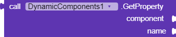

# `🧱` DynamicComponents-AI2 `Extension`

Fully supported Dynamic Components extension for MIT App Inventor 2. It is based on Java's reflection feature, so it creates the components by searching for a class by just typing its name. So it doesn't have a limited support for specific components, because it supports every component which is ever added to your App Inventor distribution!

So if you use Kodular, you will able to create all Kodular components, if you use App Inventor, you will able to create all App Inventor components and so on. Extension components are supported too!

## `🧩` Blocks

<table style="width:100%">
    <tr>
        <th>Block</th>
        <th>Parameters</th>
        <th>Description</th>
    </tr>
    <!-- CREATE  -->
    <tr>
        <td align="center">
            
        </td>
        <td>
            <table style="width:100%">
                <tr>
                    <td align="center"><code>in</code></td>
                    <td>The arrangement where component will be created in.</td>
                </tr>
                <tr>
                    <td align="center"><code>componentName</code></td>
                    <td>Specifies which component will be created, it can take these values, use one of these: ・ Name of the component.  ・ Block of existing component to create new one from it.  ・ Full class name of the component. </td>
                </tr>
                <tr>
                    <td align="center"><code>id</code></td>
                    <td>An identifier that will be used for other methods. It can be any type of text.</td>
                </tr>
            </table>
        </td>
        <td>
            Creates a new dynamic component. It supports all component that added to your current AI2 distribution.
        </td>
    </tr>
    <!-- CHANGE ID  -->
    <tr>
        <td align="center">
            
        </td>
        <td>
            <table style="width:100%">
                <tr>
                    <td align="center"><code>id</code></td>
                    <td>The old ID that will be changed.</td>
                </tr>
                <tr>
                    <td align="center"><code>newid</code></td>
                    <td>The new ID that old ID will be changed to.</td>
                </tr>
            </table>
        </td>
        <td>
            Changes ID of one of created components to a new one. The old ID must be exist and new ID mustn't exist.
        </td>
    </tr>
    <!-- SCHEMA  -->
    <tr>
        <td align="center">
            
        </td>
        <td>
            <table style="width:100%">
                <tr>
                    <td align="center"><code>in</code></td>
                    <td>The arrangement where the root component will the created in.</td>
                </tr>
                <tr>
                    <td align="center"><code>template</code></td>
                    <td>JSON string of your template.</td>
                </tr>
                <tr>
                    <td align="center"><code>parameters</code></td>
                    <td>Parameters that will be used in template.</td>
                </tr>
            </table>
        </td>
        <td>
            Creates components from JSON string. Refer to the <a href="https://github.com/ysfchn/DynamicComponents-AI2/wiki/Creating-Templates">Wiki</a> about creating your own templates.
        </td>
    </tr>
    <!-- REMOVE  -->
    <tr>
        <td align="center">
            
        </td>
        <td>
            <table style="width:100%">
                <tr>
                    <td align="center"><code>id</code></td>
                    <td>The ID of the component that will be deleted.</td>
                </tr>
            </table>
        </td>
        <td>
            Removes the component with specified ID from screen/layout and the component list. So you will able to use its ID again as it will be deleted.
        </td>
    </tr>
    <!-- SET PROPERTY  -->
    <tr>
        <td align="center">
            
        </td>
        <td>
            <table style="width:100%">
                <tr>
                    <td align="center"><code>component</code></td>
                    <td>The component that will be modified.</td>
                </tr>
                <tr>
                    <td align="center"><code>name</code></td>
                    <td>Name of the property.</td>
                </tr>
                <tr>
                    <td align="center"><code>value</code></td>
                    <td>Value of the property.</td>
                </tr>
            </table>
        </td>
        <td>
            Set a property of a component by typing its property name. Can be known as a Setter property block. 
            It can be also used to set properties that only exists in Designer. 
            Supported values are; "string", "boolean", "integer" and "float". For other values, you should use
            Any Component blocks.
        </td>
    </tr>
    <!-- GET COMPONENT  -->
    <tr>
        <td align="center">
            
        </td>
        <td>
            <table style="width:100%">
                <tr>
                    <td align="center"><code>id</code></td>
                    <td>The ID of the component that you want to get.</td>
                </tr>
            </table>
        </td>
        <td>
            Returns the component's itself for modifying purposes. 
            ID must be a valid ID which is added with Create block. 
            ID --> Component
        </td>
    </tr>
    <!-- GET ID  -->
    <tr>
        <td align="center">
            
        </td>
        <td>
            <table style="width:100%">
                <tr>
                    <td align="center"><code>component</code></td>
                    <td>The component that you want to get its ID.</td>
                </tr>
            </table>
        </td>
        <td>
            Returns the ID of component. Component needs to be created by Create block. 
            Otherwise it will return blank string. Also known as reverse of the GetComponent block. 
            Component --> ID
        </td>
    </tr>
    <!-- GET NAME  -->
    <tr>
        <td align="center">
            
        </td>
        <td>
            <table style="width:100%">
                <tr>
                    <td align="center"><code>component</code></td>
                    <td>The component that you want to get its name.</td>
                </tr>
            </table>
        </td>
        <td>
            Returns the internal name of any component or object. The returned value can be also used in Create block.
        </td>
    </tr>
    <!-- GET PROPERTY  -->
    <tr>
        <td align="center">
            
        </td>
        <td>
            <table style="width:100%">
                <tr>
                    <td align="center"><code>component</code></td>
                    <td>The component that property value will get from.</td>
                </tr>
                <tr>
                    <td align="center"><code>name</code></td>
                    <td>Name of the property.</td>
                </tr>
            </table>
        </td>
        <td>
            Get a property value of a component by typing its property name. Can be known as a Getter property block. It can be also used to get properties that only exists in Designer. 
        </td>
    </tr>
    <!-- GET DESIGNER PROPERTIES  -->
    <tr>
        <td align="center">
            
        </td>
        <td>
            <table style="width:100%">
                <tr>
                    <td align="center"><code>component</code></td>
                    <td>The component that property names and types will get from.</td>
                </tr>
            </table>
        </td>
        <td>
            Get all available properties of a component which can be set from Designer as list along with types. 
            Can be used to learn the properties of any component.
            Property values and names are joined with --- separator.
        </td>
    </tr>
    <!-- LAST USED ID  -->
    <tr>
        <td align="center">
            
        </td>
        <td>
        </td>
        <td>
            Returns the last created component's ID by Create block.
        </td>
    </tr>
    <!-- USED IDS  -->
    <tr>
        <td align="center">
            
        </td>
        <td>
        </td>
        <td>
            Returns all used IDs of current components as App Inventor list.
        </td>
    </tr>
    <!-- RANDOM UUID  -->
    <tr>
        <td align="center">
            
        </td>
        <td>
        </td>
        <td>
            Makes a random unique UUID. Use this block in Create block if component ID is not required for you.
        </td>
    </tr>
    <!-- VERSION  -->
    <tr>
        <td align="center">
            
        </td>
        <td>
        </td>
        <td>
            Returns the version of the extension.
        </td>
    </tr>
    <!-- SCHEMA CREATED  -->
    <tr>
        <td align="center">
            
        </td>
        <td>
        </td>
        <td>
            Raises after Schema has been created with Schema block.
        </td>
    </tr>
</table>

Source code is licensed under MIT license. You must include the license notice in all copies or substantial uses of the work.

## `🔨` Building

You will need:

* Java 1.8 (either OpenJDK or Oracle) 
* Ant 1.10 or higher

Then execute `ant extensions` in the root of the repository.

## `🏅` License

