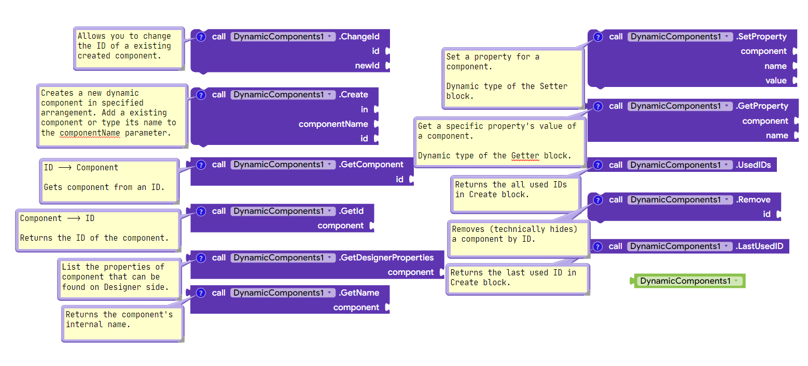

# DynamicComponents-AI2

Fully supported Dynamic Components extension for MIT App Inventor 2. It is based on Java's reflection feature, so it creates the components by searching for a class by just typing its name. So it doesn't have a limited support for specific components, because it supports every component which is ever added to App Inventor platform!

## Blocks

Source code is licensed under MIT license. 

## License
