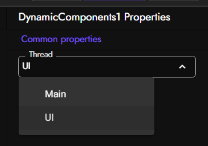
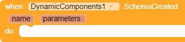
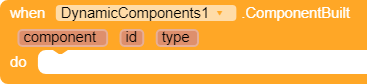

# DynamicComponents-AI2 `Extension`

Fully supported Dynamic Components extension for MIT App Inventor 2. It is based on Java's reflection feature, so it creates the components by searching for a class by just typing its name. So it doesn't have a limited support for specific components, because it supports every component which is ever added to your App Inventor distribution!

So if you use Kodular, you will able to create all Kodular components, if you use App Inventor, you will able to create all App Inventor components and so on. Extension components are supported too!

> ⚠ The `beta` branch will be reset after every release. So stay on the `main` branch if you don't know what you do.

### Asynchronous support

This extension can create components asynchronously or synchronously based on your choice. If you don't want to block the main app during creating a bunch of components, go to the Designer (after importing the extension) and select between "UI" (asynchronous) and "Main" (synchronous).

## 🧩 Blocks

<table style="width:100%">
    <tr>
        <th width="30%">Block</th>
        <th>Description</th>
    </tr>
    <!-- CREATE  -->
    <tr>
        <td align="right">
            
        </td>
        <!--<td>
            <table style="width:100%">
                <tr>
                    <td align="right"><code>in</code></td>
                    <td>The arrangement where component will be created in.</td>
                </tr>
                <tr>
                    <td align="right"><code>componentName</code></td>
                    <td>Specifies which component will be created, it can take these values, use one of these: ・ Name of the component.  ・ Block of existing component to create new one from it.  ・ Full class name of the component. </td>
                </tr>
                <tr>
                    <td align="right"><code>id</code></td>
                    <td>An identifier that will be used for other methods. It can be any type of text.</td>
                </tr>
            </table>
        </td>-->
        <td>
            Creates a new dynamic component. It supports all component that added to your current AI2 distribution.
            <code>componentName</code> parameter can have these values:
              
            <table>
                <tr>
                    <td></td>
                    <td><b>Name of the component.</b> ✅ Doesn't require to add existing component.  ❌ Only components can be created.</td>
                </tr>
                <tr>
                    <td></td>
                    <td><b>Block of existing component to create new one from it.</b> ❌ Requires a existing component. ✅ Extensions can be created also.</td>
                </tr>
                <tr>
                    <td></td></td>
                    <td><b>Full class name of the component.</b> ✅ Doesn't require to add existing component. ✅ Extensions can be created also.  To learn the class name of the component use <code>GetName</code> block.</td>
                </tr>
            </table>
        </td>
    </tr>
    <!-- CHANGE ID  -->
    <tr>
        <td align="right">
            
        </td>
        <!--<td>
            <table style="width:100%">
                <tr>
                    <td align="right"><code>id</code></td>
                    <td>The old ID that will be changed.</td>
                </tr>
                <tr>
                    <td align="right"><code>newid</code></td>
                    <td>The new ID that old ID will be changed to.</td>
                </tr>
            </table>
        </td>-->
        <td>
            Changes ID of one of created components to a new one. The old ID must be exist and new ID mustn't exist. 
            <blockquote>
                When replacing an ID, it will loop through ALL IDs and replace each one that contains the old ID! Even if the ID you're wanting to replace is "Timmy", but there are IDs like "Timmy-truck". To be clear again, only "Timmy" from "Timmy-truck" will be replaced, the "-truck" part will stay the same!
            </blockquote>
        </td>
    </tr>
    <!-- SCHEMA  -->
    <tr>
        <td align="right">
            
        </td>
        <!--<td>
            <table style="width:100%">
                <tr>
                    <td align="right"><code>in</code></td>
                    <td>The arrangement where the root component will the created in.</td>
                </tr>
                <tr>
                    <td align="right"><code>template</code></td>
                    <td>JSON string of your template.</td>
                </tr>
                <tr>
                    <td align="right"><code>parameters</code></td>
                    <td>Parameters that will be used in template.</td>
                </tr>
            </table>
        </td>-->
        <td>
            Creates components from JSON string. Refer to the <a href="https://github.com/ysfchn/DynamicComponents-AI2/wiki/Creating-Templates">Wiki</a> about creating your own templates.
        </td>
    </tr>
    <!-- REMOVE  -->
    <tr>
        <td align="right">
            
        </td>
        <!--<td>
            <table style="width:100%">
                <tr>
                    <td align="right"><code>id</code></td>
                    <td>The ID of the component that will be deleted.</td>
                </tr>
            </table>
        </td>-->
        <td>
            Removes the component with specified ID from screen/layout and the component list. So you will able to use its ID again as it will be deleted.
        </td>
    </tr>
    <!-- SET PROPERTY  -->
    <tr>
        <td align="right">
            
        </td>
        <!--<td>
            <table style="width:100%">
                <tr>
                    <td align="right"><code>component</code></td>
                    <td>The component that will be modified.</td>
                </tr>
                <tr>
                    <td align="right"><code>name</code></td>
                    <td>Name of the property.</td>
                </tr>
                <tr>
                    <td align="right"><code>value</code></td>
                    <td>Value of the property.</td>
                </tr>
            </table>
        </td>-->
        <td>
            Set a property of a component by typing its property name. Can be known as a Setter property block. 
            It can be also used to set properties that only exists in Designer. 
            It works for common types. For other values, you should use Any Component blocks.
        </td>
    </tr>
    <!-- SET PROPERTIES  -->
    <tr>
        <td align="right">
            
        </td>
        <!--<td>
            <table style="width:100%">
                <tr>
                    <td align="right"><code>component</code></td>
                    <td>The component that will be modified.</td>
                </tr>
                <tr>
                    <td align="right"><code>name</code></td>
                    <td>Name of the property.</td>
                </tr>
                <tr>
                    <td align="right"><code>value</code></td>
                    <td>Value of the property.</td>
                </tr>
            </table>
        </td>-->
        <td>
            Same as SetProperty block, but for setting the properties with Dictionary. 
            Dictionary keys equal to property names and Dictionary values equal to property value.
        </td>
    </tr>
    <!-- GET COMPONENT  -->
    <tr>
        <td align="right">
            
        </td>
        <!--<td>
            <table style="width:100%">
                <tr>
                    <td align="right"><code>id</code></td>
                    <td>The ID of the component that you want to get.</td>
                </tr>
            </table>
        </td>-->
        <td>
            Returns the component's itself for modifying purposes. 
            ID must be a valid ID which is added with Create block. 
            ID --> Component
        </td>
    </tr>
    <!-- GET ID  -->
    <tr>
        <td align="right">
            
        </td>
        <!--<td>
            <table style="width:100%">
                <tr>
                    <td align="right"><code>component</code></td>
                    <td>The component that you want to get its ID.</td>
                </tr>
            </table>
        </td>-->
        <td>
            Returns the ID of component. Component needs to be created by Create block. 
            Otherwise it will return blank string. Also known as reverse of the GetComponent block. 
            Component --> ID
        </td>
    </tr>
    <!-- GET ORDER  -->
    <tr>
        <td align="right">
            
        </td>
        <!--<td>
            <table style="width:100%">
                <tr>
                    <td align="right"><code>component</code></td>
                    <td>The component that property value will get from.</td>
                </tr>
                <tr>
                    <td align="right"><code>name</code></td>
                    <td>Name of the property.</td>
                </tr>
            </table>
        </td>-->
        <td>
            Gets the position of the component according to its parent arrangement.
            Index starts from 1.
        </td>
    </tr>
    <!-- SET ORDER  -->
    <tr>
        <td align="right">
            
        </td>
        <!--<td>
            <table style="width:100%">
                <tr>
                    <td align="right"><code>component</code></td>
                    <td>The component that property value will get from.</td>
                </tr>
                <tr>
                    <td align="right"><code>name</code></td>
                    <td>Name of the property.</td>
                </tr>
            </table>
        </td>-->
        <td>
            Sets the position of the component according to its parent arrangement.
            Index starts from 1.
            Typing 0 (zero) will move the component to the end.
        </td>
    </tr>
    <!-- MOVE  -->
    <tr>
        <td align="right">
            
        </td>
        <!--<td>
            <table style="width:100%">
                <tr>
                    <td align="right"><code>component</code></td>
                    <td>The component that property value will get from.</td>
                </tr>
                <tr>
                    <td align="right"><code>name</code></td>
                    <td>Name of the property.</td>
                </tr>
            </table>
        </td>-->
        <td>
            Moves the component to an another arrangement.
        </td>
    </tr>
    <!-- GET PROPERTY  -->
    <tr>
        <td align="right">
            
        </td>
        <!--<td>
            <table style="width:100%">
                <tr>
                    <td align="right"><code>component</code></td>
                    <td>The component that property value will get from.</td>
                </tr>
                <tr>
                    <td align="right"><code>name</code></td>
                    <td>Name of the property.</td>
                </tr>
            </table>
        </td>-->
        <td>
            Get a property value of a component by typing its property name. Can be known as a Getter property block. It can be also used to get properties that only exists in Designer. 
        </td>
    </tr>
    <!-- GET COMPONENT META  -->
    <tr>
        <td align="right">
            
        </td>
        <td>
            Get meta data about the specified component.
        </td>
    </tr>
    <!-- GET EVENT META  -->
    <tr>
        <td align="right">
            
        </td>
        <td>
            Get meta data about events for the specified component.
        </td>
    </tr>
    <!-- GET PROPERTY META  -->
    <tr>
        <td align="right">
            
        </td>
        <td>
            Get meta data about properties for the specified component.
        </td>
    </tr>
    <!-- GET FUNCTION META  -->
    <tr>
        <td align="right">
            
        </td>
        <td>
            Get meta data about functions for the specified component.
        </td>
    </tr>
    <!-- LAST USED ID  -->
    <tr>
        <td align="right">
            
        </td>
        <td>
            Returns the last component's ID.
        </td>
    </tr>
    <!-- USED IDS  -->
    <tr>
        <td align="right">
            
        </td>
        <td>
            Returns all used IDs of current components as App Inventor list.
        </td>
    </tr>
    <!-- GENERATE ID  -->
    <tr>
        <td align="right">
            
        </td>
        <td>
            Makes a random unique UUID. Use this block in Create block if component ID is not required for you.
        </td>
    </tr>
    <!-- IS DYNAMIC  -->
    <tr>
        <td align="right">
            
        </td>
        <td>
            Returns 'true' if component has created by Dynamic Components extension. Otherwise, 'false'.
        </td>
    </tr>
    <!-- INVOKE  -->
    <tr>
        <td align="right">
            
        </td>
        <td>
            Calls a method of any component. If the return value is not important for you, use with <code>evaluate but ignore result</code> block.
        </td>
    </tr>
    <!-- VERSION  -->
    <tr>
        <td align="right">
            
        </td>
        <td>
            Returns the version of the extension.
        </td>
    </tr>
    <!-- VERSION NAME  -->
    <tr>
        <td align="right">
            
        </td>
        <td>
            Returns the version name of the extension.
        </td>
    </tr>
    <!-- SCHEMA CREATED  -->
    <tr>
        <td align="right">
            
        </td>
        <td>
            Raises after Schema has been created with Schema block.
        </td>
    </tr>
    <!-- COMPONENT BUILT  -->
    <tr>
        <td align="right">
            
        </td>
        <td>
            Raises after a component has been created.
        </td>
    </tr>
</table>

## 🔨 Building

You will need:

-   Java 1.8 (either OpenJDK or Oracle)
-   Ant 1.10 or higher

Then execute `ant extensions` in the root of the repository.

## 🏅 License

Source code is licensed under MIT license. You must include the license notice in all copies or substantial uses of the work.
